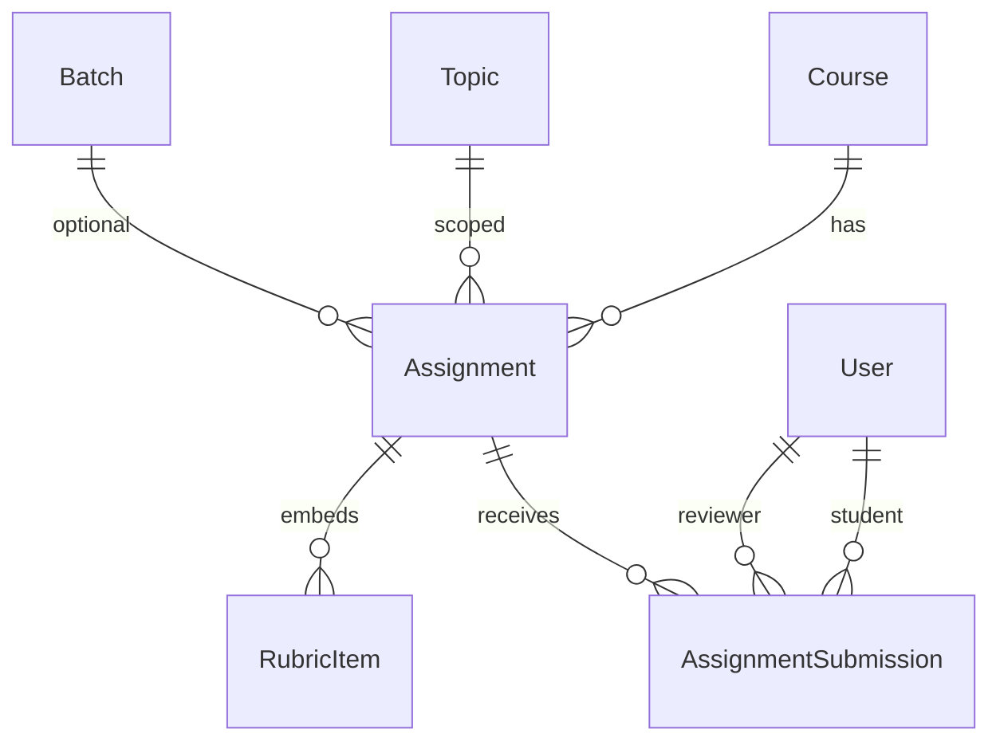

# Assignment Management System (Prompt 008)

Enterprise assignment workflow for coding and non-coding courses.

## Assignment workflow

```text
Course → Module → Week → Topic → Assignment
  → Student Submission → Teacher Review → Marks / Feedback
  → Optional Resubmission → Completed
  → Unlock Next Topic (learning-path placeholder)
```

## ER diagram



## Submission workflow

1. Student opens assignment (countdown, instructions, attachments)  
2. Submits via coding lab / file upload / link / rich text  
3. Late flag + penalty config applied  
4. Teacher opens review panel (files, code snapshot, rubrics)  
5. Approve / Reject / Needs revision + feedback notification  
6. Student may resubmit if allowed  

## Assignment types

`coding`, `project`, `file_upload`, `multiple_files`, `pdf_submission`, `zip_submission`, `image_submission`, `video_submission`, `external_link`, `github_repository`, `google_drive_link`, `rich_text`

New types can be added to `constants/assignment.js` without rewriting core services.

## Rubric architecture

Assignments embed configurable `rubrics[]` (`key`, `label`, `maxMarks`).  
Teachers award per-item scores; totals roll up to marks + percentage.  
Default rubric covers functionality, code quality, UI, naming, docs, performance, creativity, best practices.

## API documentation

Base: `/api/v1/assignments`

| Method | Path | Purpose |
|--------|------|---------|
| GET/POST | `/` | List / create |
| GET/PATCH/DELETE | `/:id` | Read / update / soft-delete |
| POST | `/:id/publish` `/:id/archive` `/:id/restore` | Lifecycle |
| PATCH | `/:id/rubrics` | Update rubrics |
| POST | `/:id/draft` | Save draft |
| POST | `/:id/submit` `/:id/resubmit` | Submit (multipart or JSON) |
| GET | `/:id/history` | Student attempt history |
| GET | `/:id/submissions` | Teacher queue |
| GET | `/submissions/:id` | Submission detail |
| POST | `/submissions/:id/grade` | Grade / revise |
| POST | `/upload` | Multipart upload |
| GET | `/analytics` | Stats |
| GET | `/dashboard/student\|teacher\|admin` | Role dashboards |

## Folder changes

```text
server/src/constants/assignment.js
server/src/models/Assignment.js
server/src/models/AssignmentSubmission.js
server/src/middlewares/upload.middleware.js  (multer)
server/src/repositories/assignment*.js
server/src/services/assignment.service.js
server/src/controllers/assignment.controller.js
server/src/routes/v1/assignment.routes.js
server/src/validators/assignment.validator.js
server/src/utils/seed-assignments.js
server/uploads/assignments/

client/src/services/assignment.service.js
client/src/components/assignment/assignment-widgets.jsx
client/src/pages/assignments/*
```

## Security notes

- Ownership checks on student submissions  
- Course access via `assertCourseAccess`  
- Upload MIME/extension + size limits (configurable per assignment)  
- Virus scan status placeholder (`skipped`)  
- Soft delete on assignments  
- Audit logs on create/update/grade  

## UI entry points

| Role | Paths |
|------|--------|
| Student | `/student/assignments`, `/student/assignments/:id` |
| Teacher | `/teacher/assignments`, `/teacher/reviews`, review panel |
| Admin | `/admin/assignments` |

## Seed

```bash
npm run seed:assignments --prefix server
```

Creates a **coding** assignment and a **PDF upload** assignment on the demo bootcamp.

## Out of scope (later)

Certificates, AI code review, live classes, attendance, payments.
