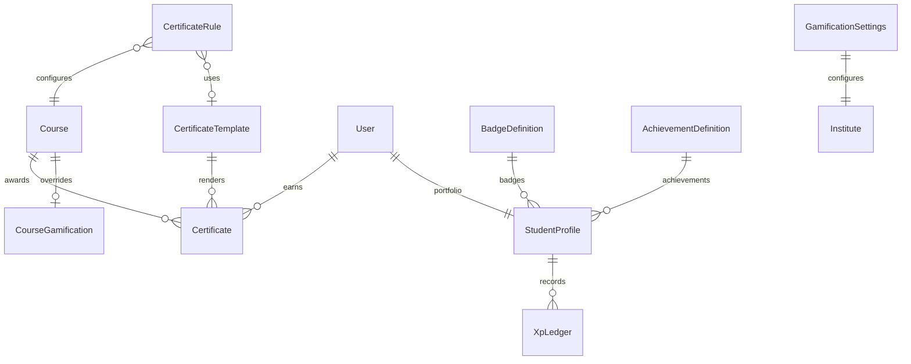

# Certificate Engine, Gamification & Achievements (Prompt 012)

## Certificate flow

```text
Configure template + rules
  → Student meets eligibility (attendance / quiz / assignment / practice / completion %)
  → Automatic issue OR pending teacher/manual approval
  → Unique certificate number + verification token + QR URL
  → Public verify page (no login)
```

## Achievement / XP flow

```text
Learning activity (lesson / practice / quiz / assignment / login / course complete)
  → gamification.awardXp (idempotent via meta.refId)
  → Update StudentProfile totalXp + level + streak
  → Evaluate AchievementDefinition criteria
  → Award badges + notify student
```

## Leaderboard flow

```text
Scope: overall | course | batch | weekly | monthly | all_time
Metric: xp | lessons | quiz | assignment | coding
  → Aggregate StudentProfile / StudentGamification / progress collections
```

## Verification flow

```text
QR / link → GET /api/v1/certificates/verify/:token
  → Return student, course, dates, status (issued | revoked | not_found)
```

## ER diagram



## API documentation

### Certificates — `/api/v1/certificates`

| Area | Paths |
|------|-------|
| Public verify | `GET /verify/:token`, `GET/POST /verify?number=` |
| Templates | `GET/POST /templates`, `GET/PATCH/DELETE /templates/:id` |
| Rules | `GET/PUT /rules/:courseId`, `GET /eligibility/:courseId` |
| Certificates | `GET /`, `GET /:id`, `POST /issue`, `POST /:id/approve`, `POST /:id/revoke` |
| Staff | `GET /pending`, `GET /admin/stats` |

### Gamification — `/api/v1/gamification`

| Area | Paths |
|------|-------|
| Me | `/me`, `/me/daily-login`, `/me/achievements`, `/me/portfolio` |
| Public | `/portfolio/public/:slug` |
| Leaderboard | `/leaderboard` |
| Config | `/settings`, `/badges`, `/achievements`, `/xp/award`, `/badges/award` |
| Admin | `/admin/dashboard`, `/admin/seed-defaults` |

## Folder changes

```text
server/src/constants/certificate.js
server/src/constants/gamification.js
server/src/models/Certificate.js (expanded)
server/src/models/Gamification.js (expanded)
server/src/repositories/certificate.repository.js
server/src/repositories/gamification.repository.js
server/src/services/certificate.service.js
server/src/services/gamification.service.js
server/src/services/achievement.service.js
server/src/services/leaderboard.service.js
server/src/services/portfolio.service.js
server/src/services/verification.service.js
server/src/controllers/certificate.controller.js
server/src/controllers/gamification.controller.js
server/src/routes/v1/certificate.routes.js
server/src/routes/v1/gamification.routes.js
server/src/utils/seed-certificates.js
client/src/services/certificate.service.js
client/src/components/certificates/*
client/src/pages/certificates/*
docs/CERTIFICATE_GAMIFICATION.md
```

## UI entry points

| Role | Paths |
|------|-------|
| Public | `/verify/certificate/:token`, `/portfolio/:slug` |
| Student | `/student/portfolio`, `/certificates`, `/leaderboard` |
| Teacher | `/teacher/achievements`, certificate approvals |
| Admin | `/admin/gamification`, templates, rules |

## Seed

```bash
cd server && npm run seed:certificates
```

Creates default template, course rules, achievements/badges, sample XP + certificate for the seeded student.

## Security

- Duplicate issued certificates blocked (409)
- Verification tokens are unguessable random hex
- Manual XP / badge awards require `gamification:manage`
- Certificate create/approve/revoke audited

## Out of scope

Payment gateway, marketplace, AI career coach, affiliate system (later prompts).
