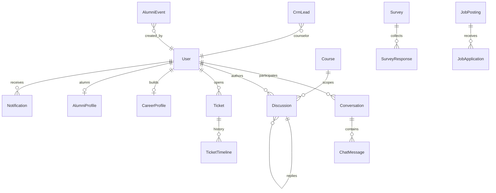

# Communication Hub, CRM, Helpdesk & Career Portal (Prompt 014)

Enterprise student-success suite: messaging, forums, helpdesk, CRM, surveys, career/jobs, alumni, and in-app notifications.

## Messaging flow

```text
Get/create conversation (direct | group | batch | course | broadcast)
  → Send message (text + attachments)
  → Read receipts / pin / archive
  → Notify other participants (new_message)
```

Typing indicators and reactions are schema-ready (`typingPlaceholder`, `reactionsPlaceholder`).

## Forum flow

```text
Course → Module → Week → Topic → (Lesson) → Thread
  → Reply / mention / like
  → Follow thread
  → Best answer / pin / lock (staff)
  → Report content
```

## Helpdesk flow

```text
Student creates ticket (category + priority)
  → Staff comments (public) / internal notes
  → Status: open → in_progress → waiting_for_student → resolved → closed
  → Reopen from resolved/closed
  → SLA placeholder (responseDueAt)
```

## CRM flow

```text
Lead → Inquiry → Counseling → Demo → Admission → Enrollment → Active → Alumni
  → Follow-ups + notes + source + counselor
  → Optional parent contact
  → Kanban board by stage
```

## Career flow

```text
Career profile (resume / skills / portfolio / freelance hub)
  → Submit for review → Staff approve / verify skills / recommend
Job board → Bookmark / Apply → Track applications
Alumni directory → Mentorship flag → Alumni events (meetup notify)
```

## Survey flow

```text
Draft survey (rating / text / MCQ / yes-no)
  → Publish → notify audience
  → Submit response (one per user)
  → Analytics: averages, satisfaction score, NPS placeholder
```

## ER diagram



## API documentation

Base: `/api/v1/communication`

| Area | Paths |
|------|-------|
| Search | `GET /search` |
| Messaging | `GET /messages/conversations`, `POST /messages/direct`, `POST /messages/group`, `GET/POST /messages/:id`, `POST /messages/:id/read`, pin/archive/search |
| Forums | `CRUD-ish /forums`, reply, like, follow, best-answer, pin, lock, report |
| Helpdesk | `GET/POST /tickets`, `GET/PATCH /tickets/:id`, comment, reopen |
| CRM | `GET/POST /crm/leads`, `GET/PATCH /crm/leads/:id`, follow-up, move stage |
| Surveys | `GET/POST /surveys`, publish, submit, analytics |
| Career | `/career/me`, profiles review, `/jobs`, apply, applications |
| Alumni | `/alumni`, events |

Platform notifications: `GET/POST /api/v1/platform/notifications` (+ mark read).

## Permission matrix

| Permission | Super Admin / Admin | Teacher | Student |
|------------|---------------------|---------|---------|
| `comm:view` | ✅ | ✅ | ✅ |
| `comm:manage` | ✅ | ✅ | — |
| `helpdesk:view` | ✅ | ✅ | ✅ (own) |
| `helpdesk:manage` | ✅ | ✅ | — |
| `crm:manage` | ✅ | — | — |
| `career:view` | ✅ | ✅ | ✅ |
| `career:manage` | ✅ | ✅ | — |

## Folder changes

```text
server/src/constants/communication.js
server/src/models/Communication.js
server/src/models/Discussion.js (expanded)
server/src/repositories/communication.repository.js
server/src/services/messaging|forum|helpdesk|crm|survey|career.service.js
server/src/controllers/communication.controller.js
server/src/validators/communication.validator.js
server/src/routes/v1/communication.routes.js
server/src/utils/seed-communication.js
client/src/services/communication.service.js
client/src/components/communication/*
client/src/pages/communication/*
docs/COMMUNICATION_HUB.md
```

## UI entry points

| Role | Paths |
|------|-------|
| Student | `/student/messages`, forums, helpdesk, career, surveys, alumni |
| Teacher | `/teacher/messages`, forums, helpdesk, career |
| Admin | `/admin/messages`, forums, helpdesk, crm, career/admin, surveys, alumni |

Notification Center lives in the top navbar (Bell).

## Seed

```bash
cd server && npm run seed:communication
```

Creates notification templates, sample chat, forum thread, ticket, CRM lead, published survey, career profile, job posting, and alumni entry.

## Security

- Role-based route permissions
- Student-scoped tickets and career data
- Attachment metadata validation (URL/mime/size fields)
- Report/moderation hooks on forums
- Audit via existing `auditService` where wired; communication actions use notification + timeline trails
- Spam / content moderation architecture-ready (report counters, internal notes)

## Out of scope (architecture ready)

- Real-time video calling
- External job board APIs
- AI career coach
- Marketplace
