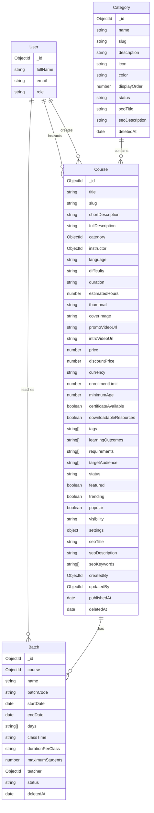

# Course Management (Prompt 003)

Enterprise course management for CodeCrafters: categories, courses, batches, and settings.  
**Out of scope:** enrollments, topics, lessons, assignments, quizzes, practice, live editor.

## ER Diagram



## Permission Matrix

| Action | Super Admin | Admin | Teacher | Student |
|--------|-------------|-------|---------|---------|
| View categories / courses / batches | ✅ | ✅ | ✅ assigned only | ❌ |
| Create / update / delete category | ✅ | ✅ | ❌ | ❌ |
| Create / update / delete course | ✅ | ✅ | ❌ | ❌ |
| Publish / archive / feature course | ✅ | ✅ | ❌ | ❌ |
| Soft delete / restore | ✅ | ✅ | ❌ | ❌ |
| Create / update / delete batch | ✅ | ✅ | ❌ | ❌ |
| Dashboard course stats | ✅ | ✅ | ✅ (scoped) | ❌ |

Middleware: `protect` + `requirePermission(...)` (`server/src/middlewares/permission.middleware.js`).  
Teachers receive `req.courseScope = 'assigned'` and only see courses/batches where they are instructor/teacher.

## REST API

Base: `/api/v1` · Auth: Bearer access token

### Categories

| Method | Path | Permission |
|--------|------|------------|
| GET | `/categories` | `course:view` |
| GET | `/categories/:id` | `course:view` |
| POST | `/categories` | `category:manage` |
| PATCH | `/categories/:id` | `category:manage` |
| DELETE | `/categories/:id` | `category:manage` |
| POST | `/categories/:id/restore` | `category:manage` |

Query: `search`, `page`, `limit`, `sortBy`, `sortOrder`, `status`

### Courses

| Method | Path | Permission |
|--------|------|------------|
| GET | `/courses` | `course:view` |
| GET | `/courses/:id` | `course:view` |
| GET | `/courses/stats/dashboard` | `course:view` |
| POST | `/courses` | `course:create` |
| PATCH | `/courses/:id` | `course:update` |
| DELETE | `/courses/:id` | `course:delete` |
| POST | `/courses/:id/restore` | `course:delete` |
| POST | `/courses/:id/publish` | `course:publish` |
| POST | `/courses/:id/archive` | `course:archive` |
| POST | `/courses/:id/feature` | `course:update` |
| POST | `/courses/bulk/status` | `course:publish` |
| POST | `/courses/bulk/delete` | `course:delete` |

Query: `search`, `page`, `limit`, `sortBy`, `sortOrder`, `status`, `category`, `difficulty`, `featured`, `trending`, `includeDeleted`

### Batches

| Method | Path | Permission |
|--------|------|------------|
| GET | `/batches` | `course:view` |
| GET | `/batches/:id` | `course:view` |
| POST | `/batches` | `batch:manage` |
| PATCH | `/batches/:id` | `batch:manage` |
| DELETE | `/batches/:id` | `batch:manage` |
| POST | `/batches/:id/restore` | `batch:manage` |

Query: `search`, `page`, `limit`, `sortBy`, `sortOrder`, `status`, `course`

### Helpers

| Method | Path | Notes |
|--------|------|-------|
| GET | `/users/instructors` | Teachers/admins for assignment dropdowns |

Response shape: `{ success, message, data }`

## Validation Rules

### Category
- `name` required (min 2)
- `slug` optional (auto from name)
- `status` ∈ `active | inactive`
- `displayOrder` ≥ 0
- SEO fields optional strings

### Course
- `title` required (min 3)
- `category`, `instructor` required ObjectIds
- `difficulty` ∈ `beginner | intermediate | advanced`
- `status` ∈ `draft | published | archived`
- `visibility` ∈ `public | private | password_protected`
- `price` ≥ 0; `discountPrice` ≥ 0 or null
- Media URLs optional valid URLs
- Settings booleans nested under `settings`

### Batch
- `course`, `name`, `batchCode`, `teacher` required
- `startDate` / `endDate` required; end ≥ start
- `days` ⊆ `friday | saturday | sunday` (min 1)
- `maximumStudents` ≥ 1
- `status` ∈ `upcoming | active | completed | cancelled`
- Unique `(course, batchCode)`

Client: Zod schemas in `client/src/lib/course-schemas.js`  
Server: express-validator in `server/src/validators/course.validator.js`

## Folder Changes

### Backend
```
server/src/
  models/Category.js, Course.js, Batch.js
  repositories/category|course|batch.repository.js
  services/category|course|batch.service.js
  controllers/category|course|batch.controller.js
  routes/v1/category|course|batch|users.routes.js
  middlewares/permission.middleware.js
  validators/course.validator.js
  utils/query.js, seed-courses.js
```

### Frontend
```
client/src/
  services/course.service.js
  lib/course-schemas.js
  hooks/use-course-paths.js, use-debounced-value.js
  components/tables/data-table.jsx
  components/cards/course-card.jsx
  components/forms/course-multi-step-form.jsx
  components/dashboard/course-dashboard-overview.jsx
  pages/courses/*, categories/*, batches/*
```

## UI Features

- Premium DataTable: search, filters, sort, pagination, column visibility, bulk publish/archive/delete, CSV export
- Course cards: thumbnail, meta, status, batch count, student placeholder, quick actions, hover motion
- Multi-step course form (Basic → Media → Pricing → Settings → SEO) with draft auto-save
- Admin / Super Admin dashboards: total, published, draft, categories, active batches, trending list
- Teacher: read-only assigned course list + details
- Student: no course management access

## Seed

```bash
npm run seed --prefix server
npm run seed:courses --prefix server
```

Demo password: `Password1`  
Accounts: `superadmin@codecrafters.dev`, `admin@codecrafters.dev`, `teacher@codecrafters.dev`, `student@codecrafters.dev`
