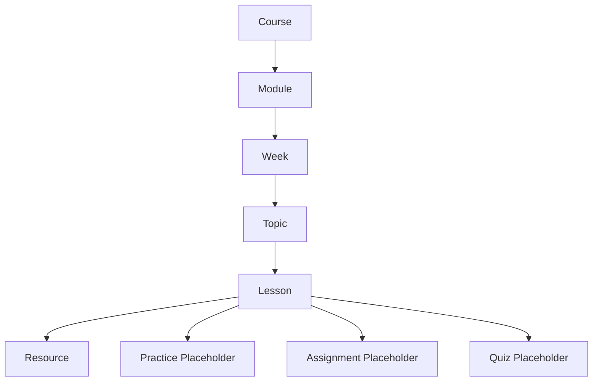
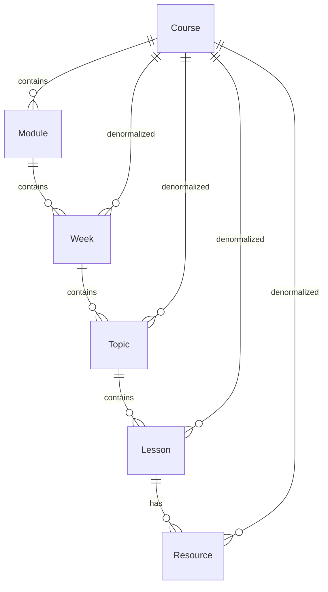
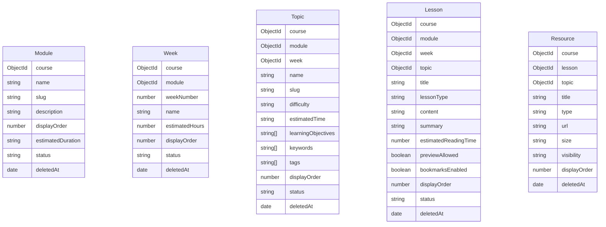

# Curriculum Builder (Prompt 004)

Nested learning paths for every course: **Module → Week → Topic → Lesson → Resource**, with Practice / Assignment / Quiz placeholders.

## Curriculum Flow



## Relationship Diagram



## ER Diagram



## Permission Matrix

| Action | Super Admin | Admin | Teacher | Student |
|--------|-------------|-------|---------|---------|
| View curriculum tree / search / stats | ✅ | ✅ | ✅ assigned | ✅ published only |
| Manage modules/weeks/topics/lessons/resources | ✅ | ✅ | ✅ assigned | ❌ |
| Reorder (DnD) | ✅ | ✅ | ✅ assigned | ❌ |
| Lesson editor | ✅ | ✅ | ✅ assigned | ❌ |
| Lesson viewer | ✅ | ✅ | ✅ assigned | ✅ published/preview |

Permissions: `curriculum:view`, `curriculum:manage` in `permission.middleware.js`.

## REST API

| Resource | Base | Notes |
|----------|------|-------|
| Tree / search / stats | `/courses/:courseId/curriculum/*` | `tree`, `search?q=`, `stats` |
| Modules | `/modules` | CRUD + `/reorder` + `/:id/restore` |
| Weeks | `/weeks` | CRUD + `/reorder` + restore |
| Topics | `/topics` | CRUD + `/reorder` + restore |
| Lessons | `/lessons` | CRUD + `/reorder` + restore |
| Resources | `/resources` | CRUD + `/reorder` + restore |

Shared list query: `search`, `page`, `limit`, `sortBy`, `sortOrder`, filters (`status`, `course`, parent ids, `lessonType`, `difficulty`, `previewAllowed`).

Reorder body:
```json
{ "course|module|week|topic|lesson": "<parentId>", "items": [{ "id": "...", "displayOrder": 0 }] }
```

## Folder Changes

### Backend
```
server/src/models/{Module,Week,Topic,Lesson,Resource}.js
server/src/repositories/{module,week,topic,lesson,resource}.repository.js
server/src/repositories/curriculum.factory.js
server/src/services/{module,week,topic,lesson,resource,curriculum}.service.js
server/src/controllers/{module,week,topic,lesson,resource,curriculum}.controller.js
server/src/routes/v1/{module,week,topic,lesson,resource,curriculum}.routes.js
server/src/validators/curriculum.validator.js
server/src/utils/curriculum-access.js
server/src/utils/seed-curriculum.js
```

### Frontend
```
client/src/services/curriculum.service.js
client/src/lib/curriculum-schemas.js
client/src/components/curriculum/*
client/src/pages/curriculum/*
```

## UI Entry Points

- Admin/Teacher: `/admin/courses/:id/curriculum` (builder + DnD)
- Lesson editor: `.../curriculum/lessons/:lessonId/edit`
- Lesson viewer: `.../curriculum/lessons/:lessonId`
- Student: `/student/courses` → `/student/learn/:courseId` → lesson viewer

## Seed

```bash
npm run seed --prefix server
npm run seed:courses --prefix server
npm run seed:curriculum --prefix server
```

## Out of scope (placeholders only)

Live code editor, practice engine, assignment submission, quiz engine, student progress logic.
