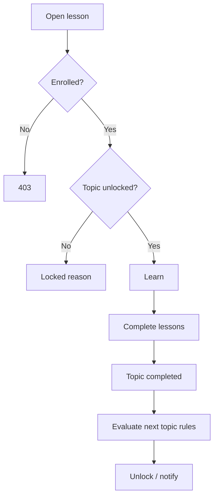
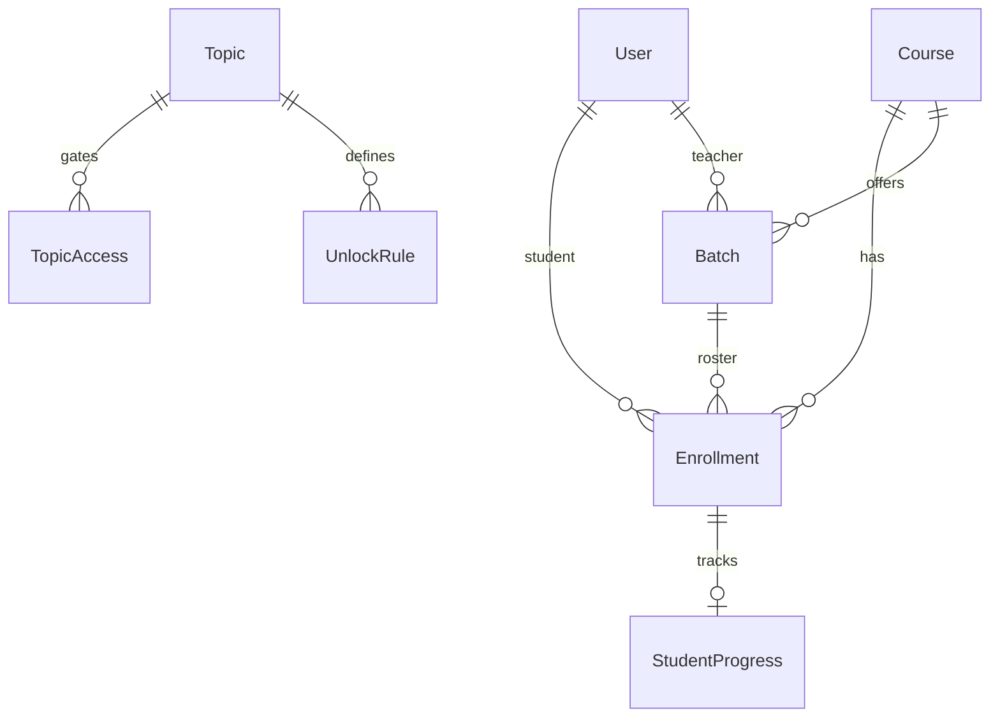

# Enrollment, Batch Management & Learning Path (Prompt 010)

Connects students → courses → batches → teachers → progress → topic unlock rules.

## Enrollment flow

```text
Manual / Bulk CSV / Self / Enrollment Code
  → Optional approval
  → Active enrollment + batch seat
  → Progress snapshot
  → Notifications
```

Invite-by-email is architecture-ready (`source: invite`).

## Batch flow

```text
Create batch → Weekly schedule → Enrollment code
  → Roster / capacity
  → Clone / Archive / Transfer students
  → Analytics + calendar
```

## Learning path flow



## Unlock rule types

| Type | Behavior |
|------|----------|
| `previous_topic_completed` | Prior topic fully completed |
| `minimum_quiz_score` | Best quiz % ≥ threshold |
| `minimum_practice_score` | Avg practice ≥ threshold |
| `assignment_approved` | Approved submission |
| `teacher_approval` / `manual_unlock` | Teacher force-unlock |
| `required_attendance` | Deferred (architecture) |
| `minimum_coding_time` | Coding ProgressEvent minutes |

Teachers can force lock/unlock via `/enrollments/topics/unlock`.

## ER diagram



## Permission matrix

| Permission | Super Admin | Admin | Teacher | Student |
|------------|-------------|-------|---------|---------|
| `enrollment:view` | ✓ | ✓ | ✓ | ✓ (own) |
| `enrollment:manage` | ✓ | ✓ | ✓ | |
| `batch:manage` | ✓ | ✓ | ✓ | |

## API documentation

Base: `/api/v1/enrollments`

| Method | Path | Purpose |
|--------|------|---------|
| GET/POST | `/` | List / manual enroll |
| POST | `/bulk` | Bulk CSV rows |
| POST | `/self` `/code` | Self / code enroll |
| POST | `/:id/approve` `reject` `withdraw` | Lifecycle |
| POST | `/:id/transfer-batch` `transfer-course` | Transfers |
| GET | `/progress/:studentId/:courseId` | Progress report |
| GET | `/learning-path/:courseId` | Path evaluation |
| POST | `/topics/unlock` | Manual lock/unlock |
| GET | `/analytics` | Platform analytics |
| GET | `/reports/batch|course|teacher` | Reports |
| GET/PATCH | `/profile/me` | Student profile |

Batches (extended): `/:id/students`, `/:id/analytics`, `/:id/calendar`, `/:id/clone`, `/:id/archive`

## Folder changes

```text
server/src/constants/enrollment.js
server/src/models/Enrollment.js
server/src/models/StudentProgress.js
server/src/services/enrollment.service.js
server/src/services/learning-path.service.js
server/src/services/student-progress.service.js
server/src/controllers/enrollment.controller.js
server/src/routes/v1/enrollment.routes.js
client/src/services/enrollment.service.js
client/src/components/enrollment/*
client/src/pages/enrollment/*
client/src/pages/batches/batch-detail.jsx
docs/ENROLLMENT_LEARNING_PATH.md
```

## UI entry points

| Role | Paths |
|------|-------|
| Student | `/student/courses`, `/student/profile` |
| Teacher | `/teacher/batches`, `/teacher/enrollments` |
| Admin | `/admin/enrollments`, `/admin/batches/:id` |

## Seed

```bash
cd server && npm run seed:enrollment
```

Enrolls `student@codecrafters.dev` into FSW-A1 (`JOIN-FSW-A1`) and configures topic unlock rules.

## Out of scope

Live class streaming, attendance tracking, certificates, payments.
