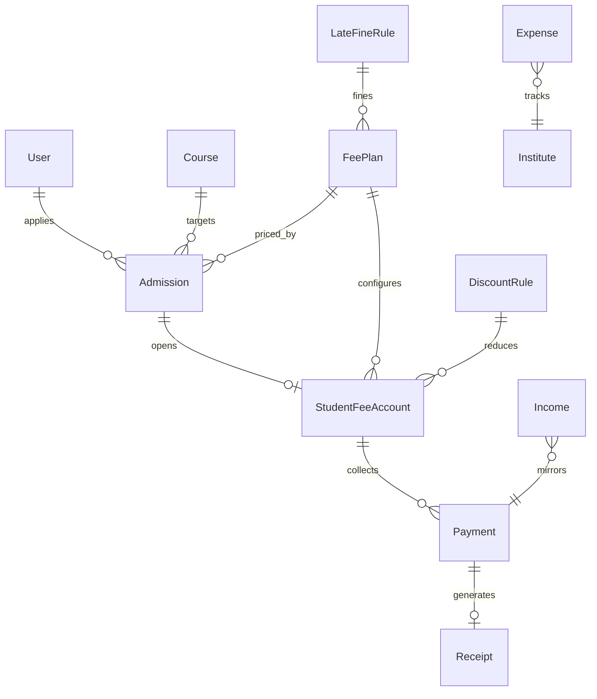

# Institute ERP — Admissions, Fees & Finance (Prompt 013)

## Admission flow

```text
Create admission (pending)
  → Assign fee plan + course/batch
  → Approve → create StudentFeeAccount + optional Enrollment
  → Reject / Cancel
```

Online admission is architecture-ready (`type: online`, `onlinePlaceholder`).

## Finance / ledger flow

```text
FeePlan (installments + late fine rule)
  → StudentFeeAccount ledger
  → Payment (cash / bank / gateway-ready)
  → Receipt (QR + printable)
  → Income auto-entry
```

## Ledger architecture

```text
StudentFeeAccount
  totalFee / paid / remaining / fine / discount / scholarship
  installments[] (due dates + status)
  ledger[] chronological entries
```

## Receipt architecture

```text
Payment / Admission event
  → unique receiptNumber + verificationToken
  → QR URL → /verify/receipt/:token (public)
  → printable ReceiptViewer
```

## ER diagram



## API documentation

Base: `/api/v1/finance`

| Area | Paths |
|------|-------|
| Dashboard | `GET /dashboard` |
| Admissions | `GET/POST /admissions`, `PATCH /:id`, `POST /:id/approve|reject|cancel` |
| Fee plans | `CRUD /fee-plans` |
| Discounts | `GET/POST /discounts`, `POST /discounts/apply` |
| Late fines | `GET/POST /late-fines` |
| Ledger | `GET /ledger/me`, `/ledger/students/:id`, `/accounts/:id` |
| Payments | `GET/POST /payments`, `POST /:id/confirm|refund` |
| Receipts | `GET /receipts`, `/receipts/:id`, public `GET /receipts/verify/:token` |
| Expenses / Income | CRUD `/expenses`, `/income` |
| Reports | `/reports/daily|monthly|outstanding|expenses|pnl`, `/reports/export/:type` |
| Teacher | `GET /teacher/status` |

Permissions: `finance:view`, `finance:manage`, `finance:collect`.

## Folder changes

```text
server/src/constants/finance.js
server/src/models/Finance.js
server/src/repositories/finance.repository.js
server/src/services/admission.service.js discount.service.js ledger.service.js finance.service.js reporting.service.js
server/src/controllers/finance.controller.js
server/src/validators/finance.validator.js
server/src/routes/v1/finance.routes.js
server/src/utils/seed-finance.js
client/src/services/finance.service.js
client/src/components/finance/*
client/src/pages/finance/*
docs/INSTITUTE_ERP_FINANCE.md
```

## UI entry points

| Role | Paths |
|------|-------|
| Public | `/verify/receipt/:token` |
| Student | `/student/fees`, account detail, receipts |
| Teacher | `/teacher/fee-status` (read-only) |
| Admin | `/admin/finance`, admissions, fee-plans, expenses, reports |

## Seed

```bash
cd server && npm run seed:finance
```

Creates fee plan, late fine + discounts, sample expenses, approved admission, fee account, and cash payment with receipt.

## Security

- Duplicate discounts blocked per account
- Payment/refund/admission actions audited
- Students scoped to own ledger/receipts
- Teachers cannot edit financial records
- Gateway methods stay `pending` until confirm (architecture ready)

## Out of scope

Real payment gateway integration, payroll, inventory, HR (later prompts).
