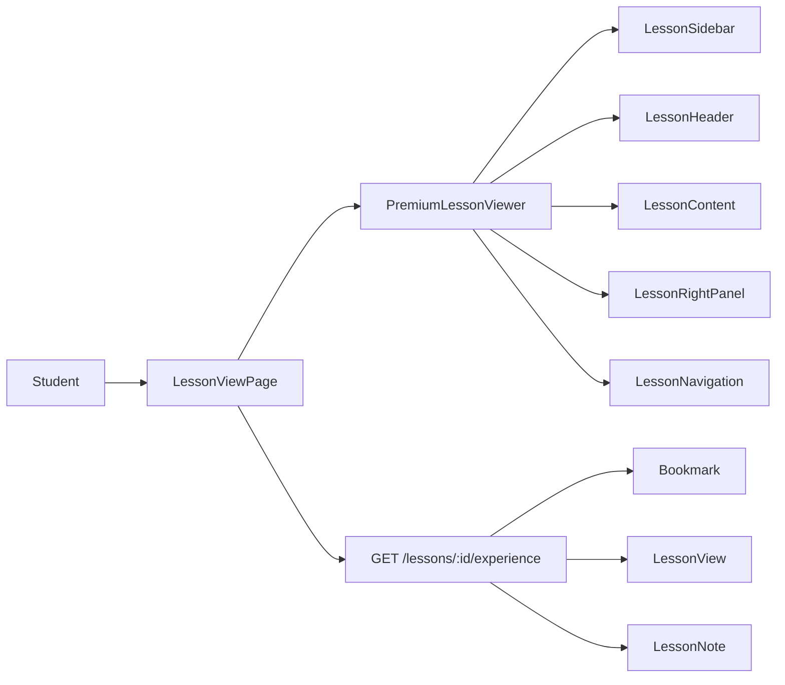

# Premium Lesson Viewer (Prompt 005)

CodeCrafters learning experience inspired by W3Schools / Notion / GitBook / VS Code — with a unique emerald/teal identity.

## Lesson Viewer Architecture



## Component Tree

```
PremiumLessonViewer
├── ReadingProgress (top bar)
├── LessonSidebar (desktop) / Sheet (mobile)
│   ├── LessonSearchBox
│   ├── Continue Learning
│   └── Module → Week → Topic → Lesson tree
├── Main
│   ├── LessonHeader (breadcrumb, badges, bookmark/share/print, progress)
│   ├── LessonContent
│   │   └── LessonSection × 12 (collapsible learning flow)
│   │       ├── MarkdownBody
│   │       ├── CodeBlock
│   │       └── AlertBox / Tip / Warning / Note
│   ├── Related Topics
│   └── LessonNavigation (sticky prev/next)
└── LessonRightPanel (desktop) / Sheet (mobile)
    ├── Topic info + objectives
    ├── Resources / Downloads (ResourceCard)
    ├── NotesPanel
    ├── AI Assistant placeholder
    └── Related lessons
```

## Responsive Layout Guide

| Breakpoint | Layout |
|------------|--------|
| Desktop (`xl`) | 3 columns: curriculum · content · details |
| Tablet (`lg`) | 2 columns: content · details; curriculum via drawer |
| Mobile | 1 column; left/right drawers via Curriculum / Details buttons |

## Learning Flow Sections

Content is parsed from markdown `##` headings into:

1. Introduction  
2. Learning Objectives  
3. Theory  
4. Explanation  
5. Examples  
6. Common Mistakes  
7. Best Practices  
8. Real World Usage  
9. Summary  
10. Key Takeaways  
11. Resources  
12. What's Next  

Unmatched headings fold into **Theory**. Empty sections show placeholders.

## API Documentation

| Method | Path | Purpose |
|--------|------|---------|
| GET | `/lessons/:id/experience` | Lesson + topic/week/module + nav + related + bookmark/note/progress |
| GET | `/lessons/:id/resources` | Lesson resources |
| GET | `/lessons/:id/related` | Related lessons |
| GET | `/lessons/search/query?course=&search=` | Lesson search |
| POST | `/lessons/:id/bookmark` | Add bookmark |
| DELETE | `/lessons/:id/bookmark` | Remove bookmark |
| POST | `/lessons/:id/progress` | Scroll % / completed |
| GET/PUT/DELETE | `/lessons/:id/notes` | Personal notes |
| GET | `/learning/dashboard` | Recently viewed, bookmarks count, continue, streak placeholder |
| GET | `/learning/bookmarks` | Saved lessons |

Permissions: `curriculum:view`, `learning:bookmark`, `learning:notes`.

## Folder Updates

```
server/src/models/{Bookmark,LessonView,LessonNote}.js
server/src/services/learning.service.js
server/src/controllers/learning.controller.js
server/src/routes/v1/learning.routes.js
server/src/routes/v1/lesson.routes.js  (experience endpoints)

client/src/components/lesson/*
client/src/pages/curriculum/lesson-view.jsx  (premium viewer)
client/src/pages/student/home.jsx           (learning dashboard)
client/src/services/curriculum.service.js   (learning APIs)
```

## Out of scope

Live code execution, browser preview, practice questions, assignments, quizzes (Prompt 006+).
