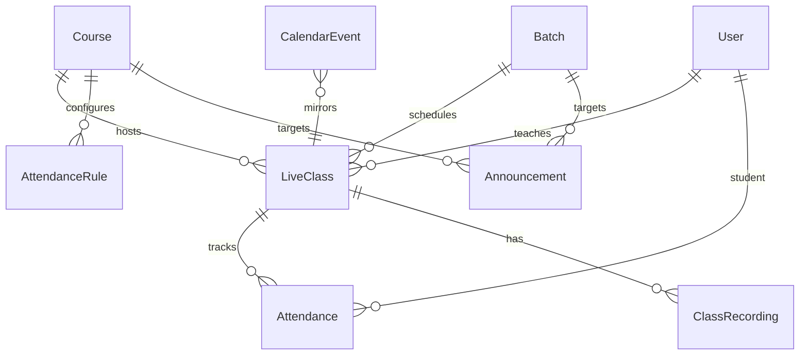

# Live Classes, Attendance & Academic Calendar (Prompt 011)

## Attendance flow

```text
Create Live Class → Ensure roster from enrollments
  → Start / End class
  → Mark Present / Late / Absent / Excused
  → Join/leave duration tracking
  → Student dashboard + analytics
```

Automatic + QR attendance are architecture-ready flags on `AttendanceRule`.

## Calendar flow

```text
Live classes + Assignments due + Quizzes + Custom events
  → Academic calendar (day / week / month / agenda)
```

## Announcement flow

```text
Draft → Publish → Audience fan-out notifications → Archive
```

## Meeting provider architecture

```text
LiveClass.meetingProvider
  → getMeetingProvider(provider)
  → Zoom | Google Meet | Teams | Custom | External Link adapters
```

Adapters implement `createMeeting` / `updateMeeting` / `cancelMeeting` / `getJoinInfo`. Stubs return join URLs today; swap implementations later without changing CRUD.

## ER diagram



## API documentation

Base: `/api/v1/live-classes`

| Area | Paths |
|------|-------|
| Classes | `GET/POST /`, `GET/PATCH/DELETE /:id`, `/:id/start|end|cancel|duplicate` |
| Schedules | `/schedule/teacher`, `/schedule/student`, `/dashboard/admin` |
| Attendance | `/:id/roster`, `/:id/attendance`, `/attendance/me`, `/attendance/rules`, `/attendance/analytics` |
| Announcements | `/announcements` CRUD + publish/archive |
| Calendar | `/calendar`, `/calendar/events` |
| Recordings | `/recordings` |

## Folder changes

```text
server/src/constants/live-class.js
server/src/models/LiveClass.js Attendance.js Announcement.js CalendarEvent.js ClassRecording.js
server/src/services/live-class.service.js attendance.service.js announcement.service.js calendar.service.js meeting-provider.service.js
server/src/routes/v1/live-class.routes.js
client/src/services/live-class.service.js
client/src/components/live/*
client/src/pages/live/*
docs/LIVE_CLASSES_ATTENDANCE.md
```

## UI entry points

| Role | Paths |
|------|-------|
| Student | `/student/classes`, `/attendance`, `/calendar`, `/announcements` |
| Teacher | `/teacher/classes`, attendance, calendar, announcements |
| Admin | `/admin/classes`, `/admin/live-overview`, calendar, announcements |

## Seed

```bash
cd server && npm run seed:live
```

Creates weekend live lab (recurring Fri–Sun), attendance rules, announcement, workshop event, sample recording.

## Out of scope

Certificates, payments, marketplace, AI teaching assistant.
