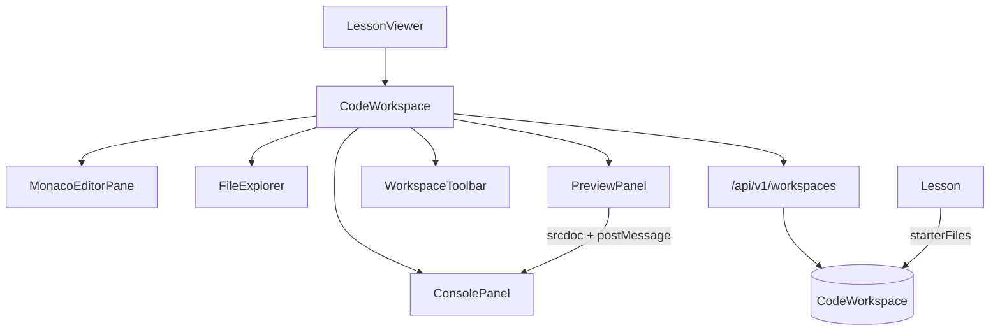

# Live Coding Workspace (Prompt 006)

Browser-based HTML/CSS/JS lab inspired by VS Code / StackBlitz / W3Schools TryIt — with a unique CodeCrafters identity.

## Workspace Architecture



## Execution Flow (Phase 1 — browser only)

1. Load workspace (`GET /workspaces/lessons/:lessonId`) — create from starter if missing  
2. Edit files in Monaco (lazy-loaded)  
3. Auto-save every 8s when dirty + manual Save (each save versions; auto skips unchanged)  
4. **Run** rebuilds iframe `srcdoc` (inline CSS/JS)  
5. Injected bridge posts `console.*` / errors to parent Console panel  
6. Reset restores instructor `starterFiles` / template  
7. Download builds ZIP via JSZip; Upload merges selected files  
8. History panel lists / restores `CodeWorkspaceVersion` snapshots  

No server-side code execution — see [PLATFORM_ARCHITECTURE.md](./PLATFORM_ARCHITECTURE.md).

## Component Tree

```
CodeWorkspace
├── WorkspaceToolbar (Run/Reset/Save/Copy/Download/Upload/Theme/Font/Wrap/Minimap/Fullscreen)
├── FileExplorer + EditorTabs
├── MonacoEditorPane (lazy @monaco-editor/react)
├── PreviewPanel + DeviceSwitcher
├── ConsolePanel (console / output / problems / AI placeholder)
├── WorkspaceStatusBar
└── ConfirmDialog (reset)
```

## API Documentation

| Method | Path | Purpose |
|--------|------|---------|
| GET | `/workspaces/lessons/:lessonId` | Load or create student workspace |
| GET | `/workspaces/lessons/:lessonId/starter` | Instructor starter template |
| POST | `/workspaces/lessons/:lessonId/save` | Save files + coding time delta |
| POST | `/workspaces/lessons/:lessonId/reset` | Reset to starter |
| GET | `/workspaces/dashboard` | Last session, coding time, saved projects |

### Lesson fields (coding)

- `enableLiveCoding` — show lab in lesson viewer  
- `codingRuntime` — `browser` now; `react|node|express|mongodb|tailwind` reserved  
- `starterFiles[]` — `{ path, language, content, entry }`  
- `expectedOutput`, `hints[]`, `solutionPlaceholder`, `challengePlaceholder`

## Folder Changes

```
server/src/models/CodeWorkspace.js
server/src/models/Lesson.js                 (+ coding fields)
server/src/services/workspace.service.js
server/src/controllers/workspace.controller.js
server/src/routes/v1/workspace.routes.js

client/src/components/workspace/*
client/src/hooks/use-code-workspace.js
client/src/lib/workspace-preview.js
client/src/services/curriculum.service.js   (+ workspaceService)
client/src/components/lesson/premium-lesson-viewer.jsx  (lab integration)
```

## Responsive Layout Guide

| Viewport | Behavior |
|----------|----------|
| Desktop `xl` | Curriculum \| Lesson \| Live Coding Workspace |
| Tablet `md–lg` | Lesson + lab stacked below content |
| Mobile `<md` | Drawer (Sheet) via **Code lab** — single mounted workspace |

## Out of scope

Automatic evaluation, practice questions, assignments, quizzes, AI debugging (Prompt 007+).
