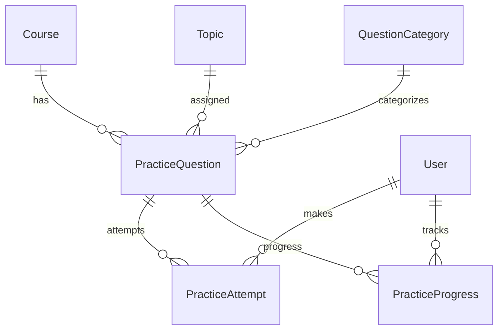

# Practice Engine & Automatic Evaluation (Prompt 007)

Enterprise practice flow similar to LeetCode / HackerRank / W3Schools Exercises — coding + MCQ fully implemented; other question types are architecture-ready.

## Practice flow

```text
Course → Module → Week → Topic → Practice Questions
       → Run / Submit → Evaluation Engine → Feedback
       → Next Question → (Assignment unlock later)
```

## ER diagram



## Question types

| Type | Status |
|------|--------|
| Coding | **Implemented** |
| Multiple Choice | **Implemented** |
| True/False, Fill blank, Arrange, Match, Short/Long, Project, File upload, Drag & drop | Architecture (`type` + `typePayload`) |

## Evaluation architecture

```text
Student Run/Submit
    │
    ▼
Practice Provider (browser | judge0 | docker | webcontainer)
    │  — never eval() in API process
    ▼
practice-evaluation.service
    │  public tests (run) / public+hidden (submit)
    ▼
PracticeAttempt + PracticeProgress
```

Providers: `server/src/config/practice-providers.js`  
Scoring: `server/src/services/practice-evaluation.service.js`  
Assertions: `expected_output`, `stdout`, `contains`, `file_contains`, `regex`, `custom`

Hidden tests never return expected/actual to students — only `hiddenSummary`.

## API documentation

Base: `/api/v1/practice`

| Method | Path | Purpose |
|--------|------|---------|
| GET/POST | `/questions` | List / create |
| GET/PATCH/DELETE | `/questions/:id` | Read / update / archive |
| POST | `/questions/:id/restore` | Restore |
| POST | `/questions/:id/clone` | Clone |
| POST | `/questions/:id/run` | Run public tests |
| POST | `/questions/:id/submit` | Submit (incl. hidden) |
| GET | `/questions/:id/attempts` | History + progress |
| POST | `/questions/:id/bookmark` | Toggle bookmark |
| GET | `/topics/:topicId/questions` | Topic practice set |
| POST | `/topics/:topicId/assign` | Assign questions |
| GET | `/dashboard` | Student practice dashboard |
| GET | `/analytics` | Question analytics |
| GET/POST | `/questions/export` `/import` | Bulk |
| GET | `/leaderboard` | Architecture stub |

## Folder changes

```text
server/src/constants/practice.js
server/src/models/PracticeQuestion.js
server/src/models/PracticeAttempt.js
server/src/models/PracticeProgress.js
server/src/models/QuestionCategory.js
server/src/config/practice-providers.js
server/src/services/practice.service.js
server/src/services/practice-evaluation.service.js
server/src/repositories/practice-*.js
server/src/controllers/practice.controller.js
server/src/routes/v1/practice.routes.js
server/src/validators/practice.validator.js
server/src/utils/seed-practice.js

client/src/services/practice.service.js
client/src/components/practice/practice-solver.jsx
client/src/pages/practice/*
```

## Security notes

1. Student code is **not** executed inside the Node API process.  
2. Browser provider scores client-reported stdout + file contents.  
3. Judge0/Docker adapters are swappable stubs.  
4. Hidden test details are stripped from submit responses.  
5. Correct MCQ answers use `select: false` and are omitted for students.

## UI entry points

| Role | Path |
|------|------|
| Student | `/student/practice` |
| Teacher | `/teacher/practice` |
| Admin | `/admin/practice` |

## Seed

```bash
npm run seed:practice --prefix server
```

Creates **Semantic Card Challenge** (coding) and **Which tag is a landmark?** (MCQ) on the Semantic HTML topic.

## Out of scope (later)

Assignment submission workflow, Quiz engine, Certificates, AI code review (Prompt 008+).
