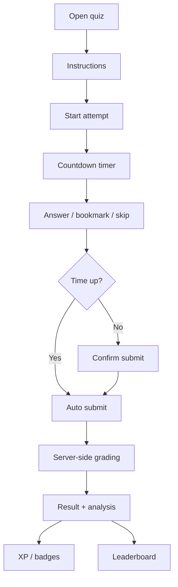
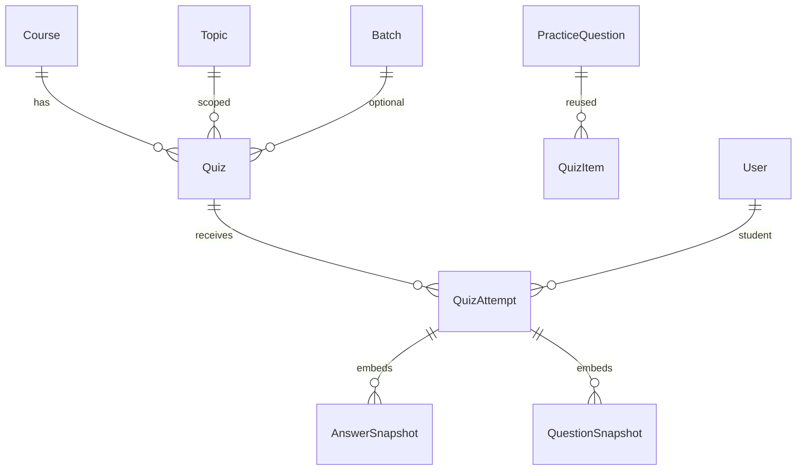

# Quiz & Assessment Engine (Prompt 009)

Enterprise quiz engine for coding, non-coding, school, and professional certification courses.

## Assessment flow

```text
Course → Module → Week → Topic → Quiz
  → Instant Result → Detailed Analysis
  → Teacher Review (optional) → Learning Recommendation
  → Unlock Next Topic (learning-path rules placeholder)
```

## Quiz flow



## ER diagram



## Question types

| Type | Status |
|------|--------|
| Multiple choice | Implemented |
| True / False | Implemented |
| Fill in the blank | Implemented |
| Coding (Prompt 007 engine) | Implemented |
| Multiple select, match, arrange, image/audio/video, short/long | Architecture-ready |

Questions come from the centralized Practice Question Bank (reuse, clone via snapshot, random pools by category / difficulty / type / language).

## Analytics architecture

- Rolling `averageScore` / `averageTimeSeconds` on `Quiz`
- Attempt aggregates: pass rate, most-missed question keys, topic/difficulty breakdown on each attempt
- Leaderboard: best percentage then fastest time per student
- Admin/teacher analytics endpoint + CSV export of results

## API documentation

Base: `/api/v1/quizzes`

| Method | Path | Purpose |
|--------|------|---------|
| GET/POST | `/` | List / create |
| GET/PATCH/DELETE | `/:id` | Read / update / soft-delete |
| POST | `/:id/publish` `/:id/archive` `/:id/restore` `/:id/duplicate` | Lifecycle |
| POST | `/:id/start` | Start attempt (blocks parallel unless resume) |
| POST | `/attempts/:attemptId/progress` | Autosave answers |
| POST | `/attempts/:attemptId/submit` | Submit (or auto) |
| GET | `/attempts/:attemptId` | Attempt / result (auto-submit if expired) |
| GET | `/:id/attempts` | Teacher results |
| GET | `/:id/history` | Student history |
| GET | `/:id/leaderboard` | Leaderboard |
| GET | `/analytics` | Platform analytics |
| GET | `/pool` | Question bank pool |
| GET | `/dashboard/student` `/dashboard/teacher` | Role dashboards |

## Folder updates

```text
server/src/constants/quiz.js
server/src/models/Quiz.js
server/src/models/QuizAttempt.js
server/src/repositories/quiz.repository.js
server/src/services/quiz*.service.js
server/src/controllers/quiz.controller.js
server/src/routes/v1/quiz.routes.js
server/src/validators/quiz.validator.js
server/src/utils/seed-quiz.js
client/src/services/quiz.service.js
client/src/components/quiz/quiz-widgets.jsx
client/src/pages/quizzes/*
```

## Security notes

- Correct option IDs / accepted answers are `select: false` on attempt snapshots
- Student payloads strip secrets until review is allowed
- Simultaneous in-progress attempts blocked (unless `resumeSupport`)
- Timer expiry forces server-side auto-submit
- Max attempts enforced server-side
- Course access checks on start / get / list attempts

## UI entry points

| Role | Paths |
|------|-------|
| Student | `/student/quizzes`, `/student/quizzes/:id`, `/student/quizzes/attempts/:attemptId` |
| Teacher | `/teacher/quizzes`, create/edit, results, analytics |
| Admin / Super Admin | Same + `/quizzes/pool` |

## Seed

```bash
cd server && npm run seed:practice && npm run seed:quiz
```

Creates true/false + fill-blank bank items and published **HTML Fundamentals Assessment**.

## Out of scope (later prompts)

Live classes, attendance, certificate generation, payment system.
